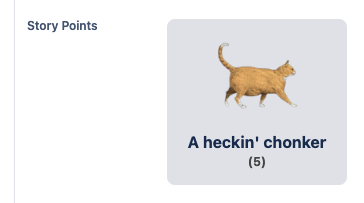

# StoryCats
This is a basic Chrome Extension that replaces Story Points with cats of various levels of chonk.

## Author
Noah Coffey

## Setup Instructions
### For Developers
1. Make a clone of this project, unzipped.
2. Open Chrome Browser
3. In a new or blank tab, type in "chrome://extensions/" (without the quotes of course) and click [Enter].
4. At the top right corner of the page, **enable** "Developer Mode"
5. Click the button on the page that says "Load Unpacked"
6. Navigate to your unzipped project folder and select that and hit OK.
7. You are now ready to start working on the extension! Just make sure you reload after each change you make to see the changes take place.

## License
Please refer to LICENSE file.
